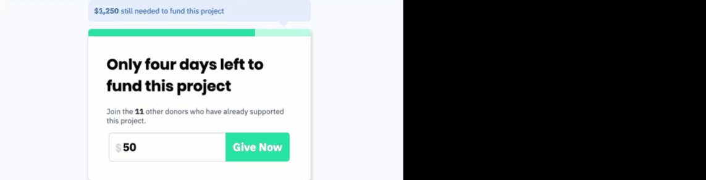

# React, Parcel, Scss Example

This project can be viewed at https://2jizm.csb.app/

### Installation

Run `npm install` to download needed modules.

### Run the project

Run `npm start` to run the project locally

### Tests

To run tests type `npm test-watch`, this will detect any changes made to the test files and will run the tests
